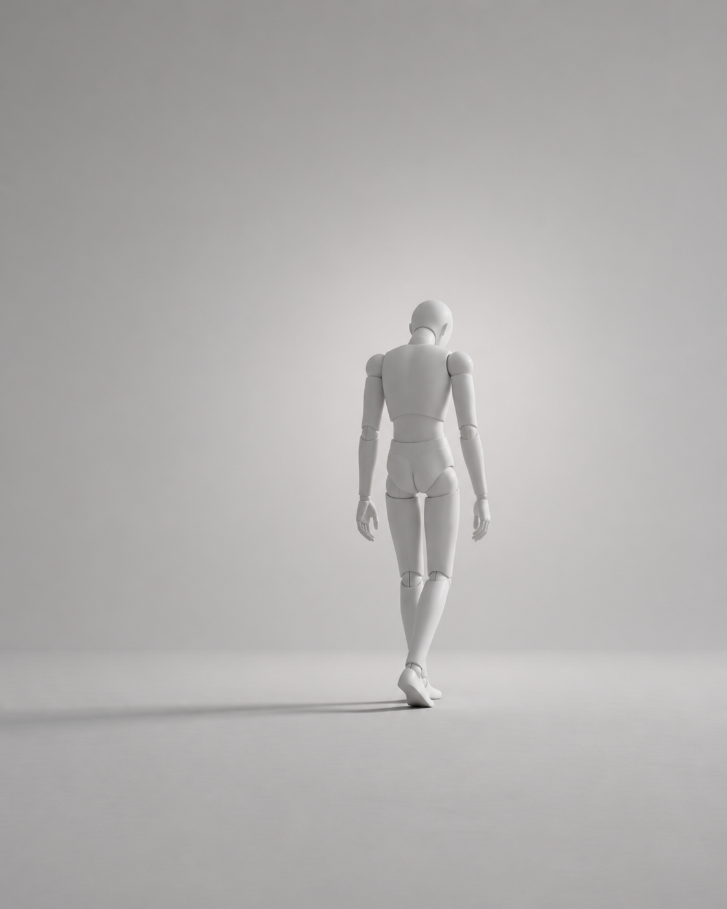
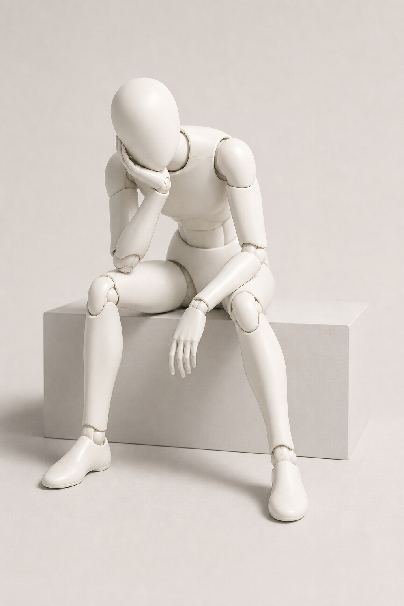
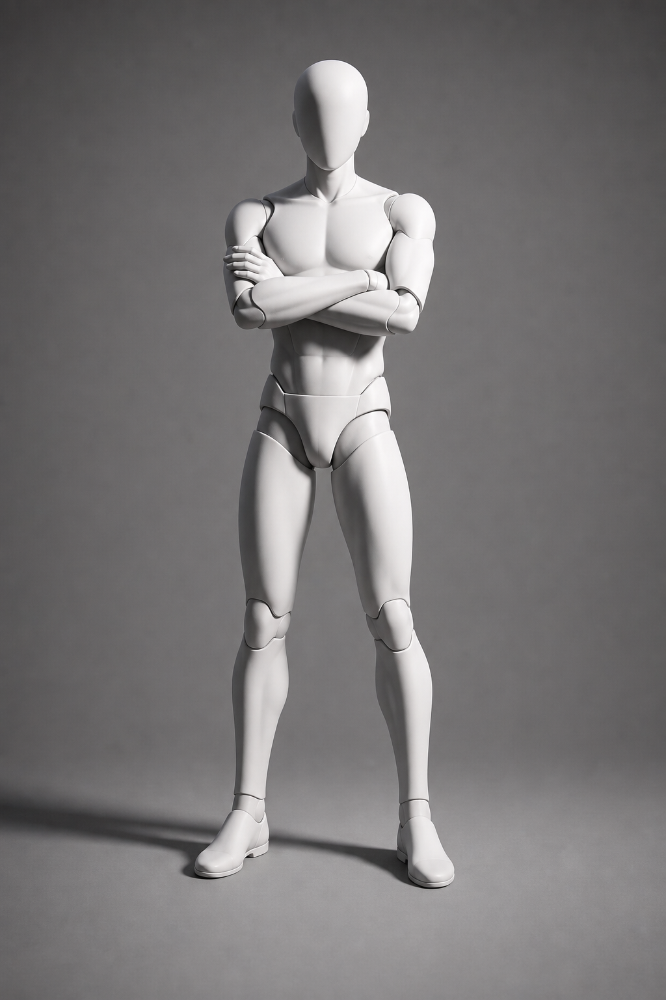
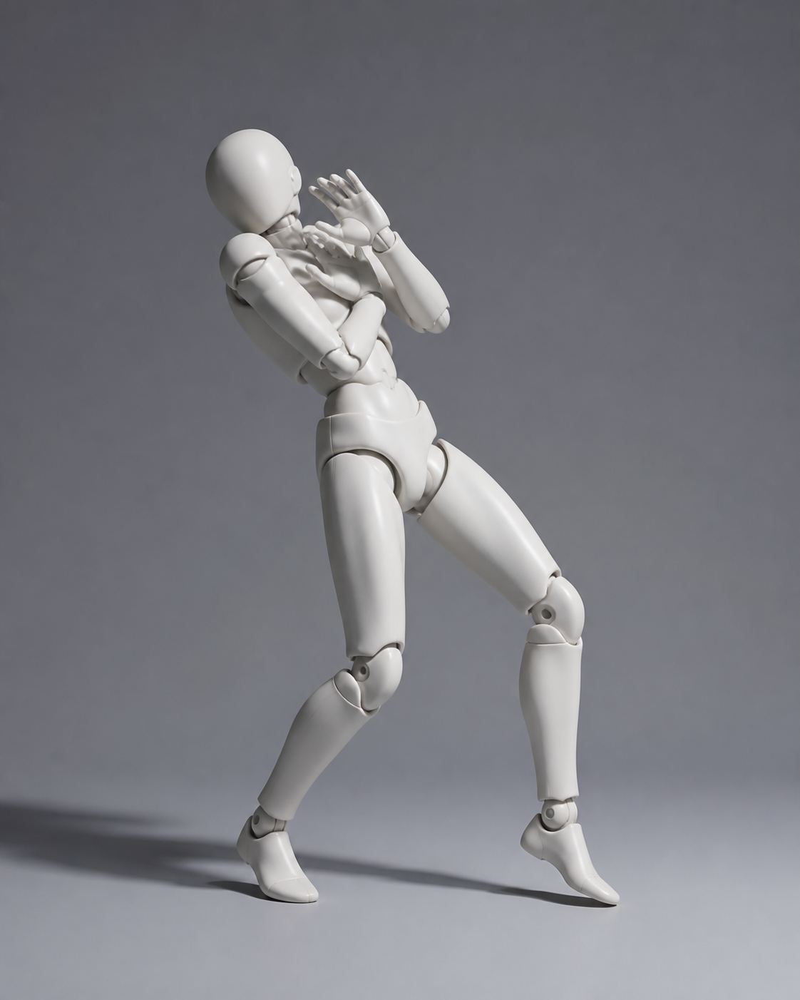

# Fashion Pose Reference

A Codex skill for turning emotion/action words into strict body-pose references and mannequin/stick-figure image prompts.

This repository provides the skill only. It does not include a dataset, crawler, training pipeline, or third-party fashion images.

## Install

Clone the repository:

```bash
git clone https://github.com/MrCarlsama/fashion-pose-reference.git
```

Install as a global Codex skill:

```bash
mkdir -p ~/.codex/skills/fashion-pose-reference
cp fashion-pose-reference/.codex/skills/fashion-pose-reference/SKILL.md \
  ~/.codex/skills/fashion-pose-reference/SKILL.md
```

Or install it into a single project:

```bash
mkdir -p .codex/skills/fashion-pose-reference
cp fashion-pose-reference/.codex/skills/fashion-pose-reference/SKILL.md \
  .codex/skills/fashion-pose-reference/SKILL.md
```

Restart Codex after installation if the skill does not appear immediately.

## Use

Call the skill by name:

```text
[$fashion-pose-reference] 孤独 背影 离场，女性角色，全身
```

More examples:

```text
[$fashion-pose-reference] 无聊 托腮 等待，半身，日常低能量
[$fashion-pose-reference] 冷淡 抱臂 男模，全身，硬光
[$fashion-pose-reference] 惊恐 警觉 后退，全身
[$fashion-pose-reference] 给我一个人体模型简笔画动作参考提示词：兴奋 跳跃
```

The skill returns:

- `动作参考描述`
- `人体模型简笔画生图提示词`
- `验证用 imagegen 英文提示词`
- `生成决策`

## What It Enforces

The skill treats emotion as visible body mechanics, not as a loose label.

- `托腮` must show hand-to-chin/face support.
- `抱臂` must visibly close the chest with crossed or hidden arms.
- `背影离场` must show a turned-away or leaving body.
- `双手扶头/护头` must show both hands or arms touching, holding, wrapping, or protecting the head.
- `后退/惊恐` must show recoil, backward weight shift, or retreat.
- `兴奋/开心` needs real dynamic release, such as jump, dance, spin, run, large stride, or airborne motion.

If the body mechanic and emotion conflict, the skill should say so instead of pretending the pose is valid.

## Example Images

These are imagegen-generated pose reference images included to show the expected output style. They are not dataset images.

| Request | Example |
| --- | --- |
| `孤独 背影 离场` |  |
| `无聊 托腮 等待` |  |
| `冷淡 抱臂` |  |
| `惊恐 后退` |  |

## Boundary

This is a prompt-and-review skill. It does not train a model and does not ship a fashion corpus.

If you use your own reference images, make sure you have the right to store and publish them.

## License

Code, documentation, and included generated example images are released under the MIT License.
